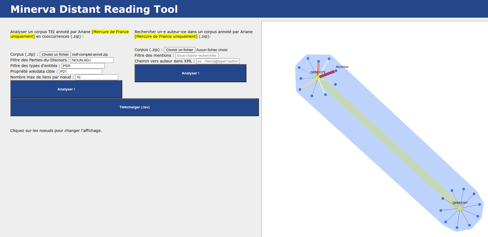
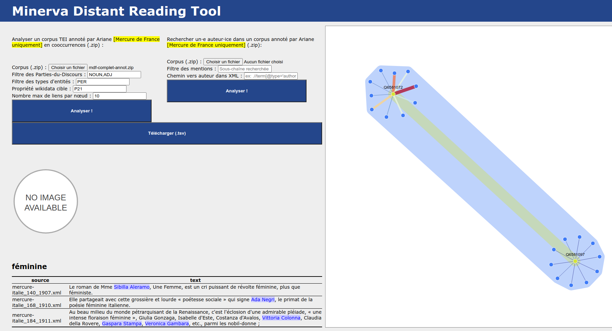
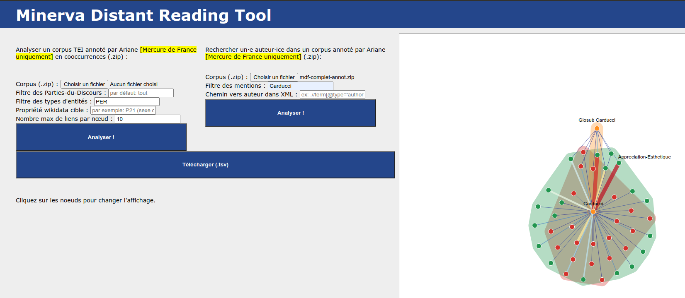
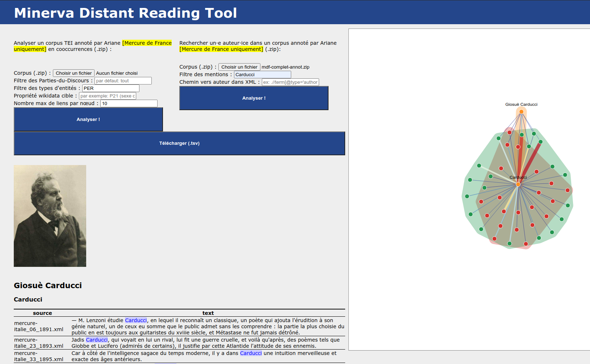
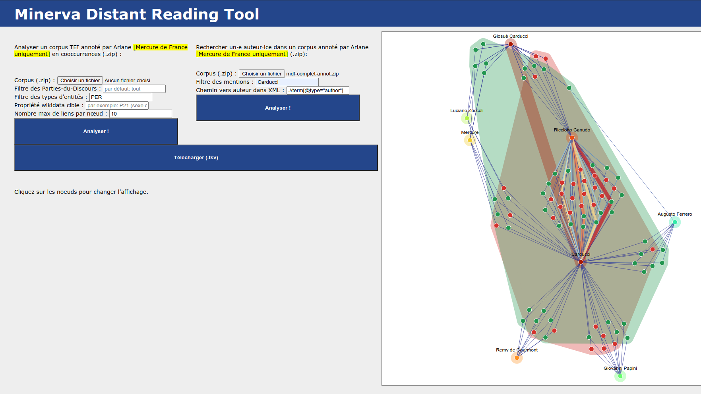

# Installation

## Installer python

Sous Linux et MacOS, python est installé par défaut.

Sous Windows, il est normalement possible d'installer une version récente de
python via le store.

## Préparer son environnement

Il est recommandé de créer un environnement virtuel python3 avant de commencer
(testé avec python3.7) :

```
python3 -m venv /chemin/vers/venv
```

Où `venv` est le nom de l'environnement virtuel à créer. Pour activer
l'environnement créé :

### Linux

```
source /chemin/vers/venv/bin/activate
```

### Windows

1. Via l'invite de commande `cmd.exe` :

```
\chemin\vers\venv\Scripts\activate.bat
```

Aucun besoin particulier pour lancer ce script dans l'invite de commande.

2. Via powershell `powershell.exe` :

```
\chemin\vers\venv\Scripts\activate.ps1
```

Note : pour la version powershell, il faut au préalable modifier la politique
d'exécution des scripts. Par défaut, leniveau est `Restricted` (restreint). Il
faut le changer à `Unrestricted` (non restreint). Pour cela, il faut lancer
powershell en mode administrateur puis lancer la commande :

```
Set-ExecutionPolicy Unrestricted
```

Pour remettre la valeur par défaut, la commande est :

```
Set-ExecutionPolicy Restricted
```

## Installer les prérequis

Pour installer les prérequis dans un environnement:

```
python -m pip install -r requirements.txt
```

Pour installer les prérequis sans environnement:

```
python -m pip install -r requirements.txt --user
```

## Télécharger le modèle spacy

Une fois les prérequis installés, il faut télécharger le modèle SpaCy utilisé
pour le traitement des données :

```
spacy download fr_core_news_md
```

# Lancer l'application

Pour lancer l'application, se placer dans le dossier contenant `app.py` puis :

```
flask run
```

Cela lancera l'application en local, l'adresse sera affichée dans le terminal.
Elle est généralement `http://127.0.0.1:5000/`

# Cas d'usage

## Cas 1 : cooccurrences spécifiques d'entités nommées

Ce cas d'usage permet de rechercher des cooccurences spécifiques par entités. Ce
cas permet également de regrouper les entités nommées selon les propriétés
Wikidata qui leur sont associées.

Exemple sur le Mercure de France préannoté en regroupant les entités selon la
propriété Wikidata P21 (sexe ou genre) :



Il est possible de cliquer sur les noeuds ou les zones afin d'effectuer un
retour au texte :



## Cas 2 : fouille d'opinion

Ce cas d'usage permet de fouiller les opinions/sentiments exprimées sur des
entités du texte. L'analyse des opinions est faite via la plateforme Ariane.
À l'heure actuelle, les entités douvent être préalablement reconnues et
désambiguisées.

Ce cas d'usage permet de récupérer les opinions sur des entités désambiguisées,
avec la possibilité de comparer les résultats sur les différentes formes sous
lesquelles elle est mentionnée.

Exemple d'opinions sur le Mercure de France préannoté pour Carducci :



Il est possible de cliquer sur les noeuds ou les zones afin d'effectuer un
retour au texte :



Il est possible de lier ces opinions à une métadonnée des documents du corpus.
Par exemple, pour l'ensemble des critiques littéraires du Mercure de France, il
est possible de relier les opinions aux critiques qui les ont exprimées :


